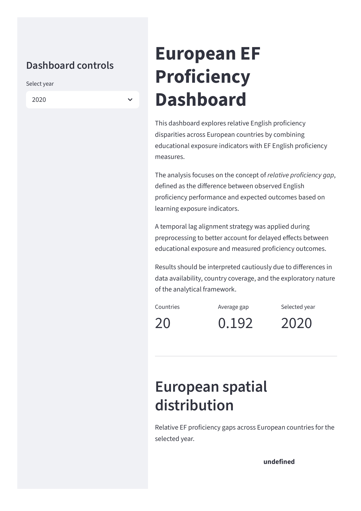

# European EF Proficiency Dashboard

Interactive data visualization project exploring relative English proficiency disparities across European countries through educational exposure indicators and EF English proficiency measures.

The project combines preprocessing pipelines, exploratory analysis, publication-style visualizations, and an interactive Streamlit dashboard.

---

## Dashboard preview



Full dashboard export available in:
[EF Proficiency Dashboard PDF](docs\EF Proficiency Dashboard.pdf)

---

## Project objectives

This project investigates whether observed English proficiency outcomes across Europe align with expected educational exposure patterns.

The analysis focuses on the concept of **relative proficiency gap**, defined as:

> EF proficiency percentile − learning exposure percentile

Positive values indicate countries performing above expected educational exposure levels, while negative values indicate relative underperformance.

The project aims to:
- explore spatial disparities across Europe,
- analyse temporal evolution of proficiency gaps,
- compare country-level performance,
- provide an interactive exploratory dashboard,
- support policy-oriented interpretation through visual analytics.

---

## Methodological overview

The analytical pipeline combines:
- EF English Proficiency Index (EF EPI) data,
- educational exposure indicators,
- harmonised country-level European datasets.

A **temporal lag alignment strategy** was implemented during preprocessing:
- learning exposure measured at time `t`,
- proficiency outcomes aligned at `t + 4`.

This approach attempts to account for delayed educational effects on later proficiency outcomes.

The project remains exploratory and observational:
- no causal inference is claimed,
- data availability and country coverage remain heterogeneous,
- EF EPI measurements contain known sampling limitations.

---

## Project structure

```text
Project Visualisation EF/
│
├── dashboard/
│   └── app.py
│
├── data/
│   ├── raw/
│   │   └── efepi_rankings.csv
│   │
│   └── processed/
│       └── merged_analytical.csv
│
├── docs/
│   ├── instructions/
│   ├── proposal/
│   └── dashboard_preview.png
│
├── notebooks/
│   ├── 01_data_collection.ipynb
│   ├── 02_preprocessing.ipynb
│   ├── 03_exploration.ipynb
│   └── 04_visualizations.ipynb
│
├── src/
│   ├── harmonization.py
│   └── preprocessing.py
│
├── README.md
└── requirements.txt
```

---

## Exploratory Workflow

### 01 — Data Collection

- import and initial inspection of raw datasets,
- EF EPI rankings integration,
- dataset preparation.

### 02 — Preprocessing

- harmonisation across datasets,
- percentile standardisation,
- temporal lag alignment,
- construction of `gap_pct`.

### 03 — Exploration

- data quality assessment,
- distribution analysis,
- temporal evolution,
- country comparisons.

### 04 — Visualizations

- publication-style visual storytelling,
- choropleth maps,
- comparative rankings,
- temporal trend visualizations,
- interactive dashboard integration.

---

## Streamlit Dashboard Features

The interactive dashboard includes:

- interactive European choropleth maps,
- temporal evolution visualizations,
- country ranking comparisons,
- Italy vs Europe trajectory analysis,
- filtered dataset exploration.

---

## Run Locally

### Clone the Repository

```bash
git clone https://github.com/lolipop913/Project-Visualisation-EF.git
cd Project-Visualisation-EF
```

### Create and Activate a Virtual Environment

```bash
python -m venv .venv
```

### Install Dependencies

```bash
pip install -r requirements.txt
```

### Launch the Dashboard

```bash
cd dashboard
streamlit run app.py
```

---

## Main Findings

Key exploratory patterns include:

- persistent spatial disparities across Europe,
- relatively stable average proficiency gaps over time,
- strong positive performance in Northern Europe,
- relative underperformance in several Southern European countries,
- weak alignment between educational exposure and observed proficiency outcomes alone.

---

## Technologies Used

- Python
- pandas
- Plotly
- Streamlit
- Jupyter Notebook

---

## GitHub Repository

https://github.com/lolipop913/Project-Visualisation-EF

Additional collaborative resources and project materials were maintained through a shared Google Drive workspace during development.

---

## Author

Henri Vasserot  
MSc Data Science — University of Trento